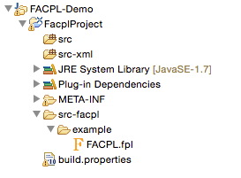
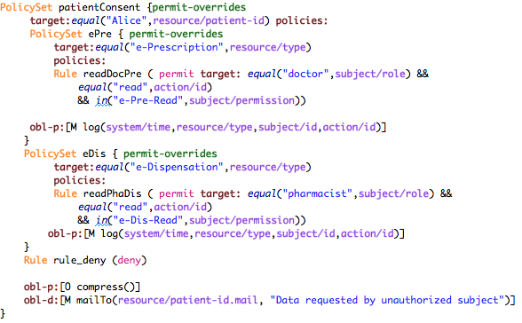
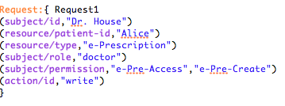

.. _usage-page:

Usage guide
------------

Setting Up a FACPL Project
^^^^^^^^^^^^^^^^^^^^^^^^^^

A FACPL project can be created from the project menu *"File -> New
Project ..."*, where the customised wizard *FACPL Development Project*
is available. After choosing a project name, the wizard creates a new
Java Plugin-Development Project that contains all the required libraries
for the coding and evaluation tasks; note that the project name cannot
contain any blank space.

The generated FACPL project is like the one reported in Figure 3. FACPL
files are generic text files having the "*.fpl*" extension and, for
practical convenience, are placed in the *src-facpl* folder; a policy
demo is added to the auto-generated project. The FACPL Java-translated
policies and requests are automatically placed in the *src* folder.
Instead, the *src-xml* folder contains the generated XML files and the
*src-smtlib* folder contains the generated SMT-LIB files.

A new FACPL file can be created either as a new generic file with
extension "*.fpl*" or by using the *FACPL File* wizard from the command
*File -> New...* in the menu. The wizard permits specifying the
container of the file (by selecting it from the projects available in
the workspace), the name of the file, and some basic code examples to
add to the new file.

Policy Specification
^^^^^^^^^^^^^^^^^^^^

A FACPL file is composed of three different parts (for which the new
file wizard provides basic templates):

-  *Policy declarations*: define the access control policies and the
   algorithms used for calculating and enforcing authorisation
   decisions.
-  *Request declarations*: define the attributes values modeling an
   access attempt. The requests will be evaluated with respect to the
   available policies to obtain the corresponding authorisation
   decisions.
-  *Main*: defines the Policy Authorisation System (PAS), i.e. the PEP
   and PDP, and some options for the generation of Java code and for
   request evaluation. More details on this part are presented in
   `Plugin Commands and Facets <#PluginCommands>`__.

An access control policy is hierarchically structured in terms of
*rules* and *policy sets*, where a rule is a basic element for
specifying access controls, while a policy set is a collection of other
policies.

A **rule** specifies a name, the positive or negative decision of its
successful evaluation (i.e., permit or deny), and a target expression
for checking the applicability with respect to a request.

A **target** is a boolean expression defining the conditions deciding if
the enclosed policy has to authorised an incoming request. The
expressions are formed by basic relational and arithmetic operators.
Such opertors define conditions on requests by means of *attribute
name*. The available operators and some special attribute names (e.g. to
get the current time) are provided by the auto-completion feature (e.g.,
for Mac/s users ⌘+Space) of the plugin. Attribute names are of the form
*Identifier/Identifier*, where the first identifier stands for a
category name and the second for an attribute name. For example, the
name *action/action-id* represents the value of the attribute
*action-id* within the category *action*. Notably, the plugin provides a
type inference system checking that the expressions are correctly typed.

A **policy set** specifies a name, the combining algorithm to be used
for combining the results of the contained policies, and a target
expression for defining its applicability. The available combining
algorithms are: *permit-overrides, deny-overrides, permit-unless-deny,
deny-unless-permit, first-applicable, only-one-applicable,
weak-consensus and strong-consensus*. The behaviour of each of them is
presented in `Policy Evaluation <#evaluation>`__. Each algorithm is
paired with a fulfilment strategy, i.e. *all* or *greedy*, leading its
evaluation (see below). In addition, if different behaviours are
requested, it is also possible to specialise the *custom-algorithm*.
Furthermore, the command **include** permits to add, by means of name
reference, a policy set to another one.

Each of the previous elements can also include a list of obligations. An
**obligation** specifies an effect, i.e. permit or deny, for the
applicability of the obligation, a type, i.e. M for Mandatory and O for
Optional, and the identifier of an action with its argument. These
arguments are generic expressions possibly containing attribute names,
while the set of action identifiers understood by the PEP can be chosen,
from time to time, according to the specific application.

The definition of the policy authorisation system (PAS), in addition to
the access control policies defining the PDP, defines the top-level
combining algorithm for the PDP (i.e., one among the algorithms already
mentioned) and the enforcement algorithm for the PEP (i.e., one among
*base*, *permit-biased* and *deny-biased*).

The following figure reports an example of policy declaration from an
`e-Health case
study <http://facpl.sourceforge.net/eHealth/index.html>`__.

The policy manages all the requests for the management of the
*e-Prescription* service of the patient named 'Alice'. The rules checks
the credentials exposed by the requester (i.e., the permission) and the
requested actions.

We briefly comment part of the reported policy. The policy named "ePre"
checks, by means of its target, if the requested service is
"e-Prescription", then the internal rules check the exposed credentials
according to the requested actions. By way of example, the rule named
"writeDoc" authorises with permit (i.e., a positive authorisation) a
subject whose role is doctor (i.e., by using attribute *subject/role*)
and whose permissions contain both the permissions "e-Pre-Read" and
"e-Pre-Write". Notably, the rules are evaluated in the same order as
they appear within the policy. Thus, since the chosen combining
algorithm is permit-overrides (see below), if the first rule evaluates
correctly (i.e. it returns permit) then the second rule is not
evaluated. Finally, the obligation *log* is used to record in the system
the authorised access. The other rules are similarly defined, as well as
the obligation *mailTo*.

Figure 5 reports an example of FACPL request. Specifically, it
represents the "doctor" with id "Dr. House" and credentials "e-Pre-Read"
and "e-Pre-Write", willing to "write" an "e-Prescription" for the
patient with id "Alice". This request is authorised to permit by the
previous policy.

Policy Evaluation
^^^^^^^^^^^^^^^^^

The evaluation of a request with respect to a policy generates one among
the following *authorization decisions*:

-  **permit**: the request is granted;
-  **deny**: the request is not granted;
-  **not-applicable**: there is no policy that applies to the request;
-  **indeterminate**: some errors occurred in the evaluation.

When the resulting authorisation decision is **permit** or **deny** some
obligations can possibly be present.

The **evaluation of a policy** with respect to a request starts by
checking its applicability to the request, which is done by evaluating
the expression defining its target. Evaluating expressions amounts to
apply operators and to resolve the attribute names occurring within,
that is to determine the value corresponding to each such name. If this
is not possible, i.e. an attribute with that name is missing in the
request and cannot be retrieved through the context handler, the special
value ⊥ is returned. This value can be explicitly managed by the various
operators. The evaluation of a policy has indeed the following cases:

-  Let us suppose that the applicability holds, i.e. the expression
   evaluates to *true*. In case of rules, the rule effect is returned.
   In case of policy sets, the result is obtained by evaluating the
   contained policies and combining their evaluation results through the
   specified algorithm. In both cases, the evaluation ends with the
   fulfilment of the enclosed obligations.
-  Let us suppose now that the applicability does not hold. If the
   expression evaluates to *false* or ⊥, the policy evaluation returns
   *not-applicable*, while if the expression returns an error or a
   non-boolean value, the policy evaluation returns *indeterminate*.

Clearly, a policy with target expression true (resp., false) applies to
all (resp., no) requests. The evaluation process of rules and policy
sets is summarised, respectively, in Tables 1 and 2.

+--------------------------------+----------------------+----------------------+
| Target                         | Obligation           | **Rule Result**      |
+--------------------------------+----------------------+----------------------+
| *true*                         | *fulfilled*          | *rule effect + FO*   |
+--------------------------------+----------------------+----------------------+
| *true*                         | *fulfilment error*   | *indeterminate*      |
+--------------------------------+----------------------+----------------------+
| *false* or ⊥                   | -                    | *not-applicable*     |
+--------------------------------+----------------------+----------------------+
| *error* or non-boolean value   | *-*                  | *indeterminate*      |
+--------------------------------+----------------------+----------------------+

Table 1. Rule evaluation (where FO stands for 'fulfilled obligations')

+--------------------------------+----------------------------+----------------------+---------------------------------+
| Target                         | Combining Algorithm        | Obligation           | **Policy Set Result**           |
+--------------------------------+----------------------------+----------------------+---------------------------------+
| *true*                         | *permit* (resp., *deny*)   | *fulfilled*          | *permit* (resp., *deny*) + FO   |
+--------------------------------+----------------------------+----------------------+---------------------------------+
| *true*                         | *not-applicable*           | -                    | *not-applicable*                |
+--------------------------------+----------------------------+----------------------+---------------------------------+
| *true*                         | *indeterminate*            | -                    | *indeterminate*                 |
+--------------------------------+----------------------------+----------------------+---------------------------------+
| *true*                         | *permit* (resp., *deny*)   | *fulfilment error*   | *indeterminate*                 |
+--------------------------------+----------------------------+----------------------+---------------------------------+
| *false* or ⊥                   | -                          | -                    | *not-applicable*                |
+--------------------------------+----------------------------+----------------------+---------------------------------+
| *error* or non-boolean value   | *-*                        | -                    | *indeterminate*                 |
+--------------------------------+----------------------------+----------------------+---------------------------------+

Table 2. Policy set evaluation (where FO stands for 'fulfilled
obligations')

Concerning the **evaluation of expressions**, it takes into account the
types of the operators arguments, and possibly returns the special value
⊥ and *error*. In details, if the arguments are of the expected type,
the operator is applied, else, i.e. at least one argument is *error*,
*error* is returned; otherwise, i.e. at least one argument is ⊥ and none
is error, ⊥ is returned. The expression operators *and* and *or* enforce
a different treatment of these special values. Specifically, *and*
returns *true* if both operands are *true*, *false* if at least one
operand is *false*, ⊥ if at least one operand is ⊥ and none is *false*
or *error*, and *error* otherwise (e.g. when an operand is not a boolean
value). The operator *or* is the dual of and. Hence, and and or may mask
⊥ and *error*. Instead, the unary operator *not* only swaps values
*true* and *false* and leaves ⊥ and *error* unchanged. The other
expression operators have the expected semantics (e.g., operator *equal*
checks if the arguments are equal) and enforce the management strategy
for the special values ⊥ and *error* possibly resulting from the
evaluation of their arguments. Indeed, they establish that *error* takes
precedence over ⊥ and is returned every time the operator arguments have
unexpected types; whereas ⊥ is returned when at least an argument is ⊥
and there is no *error*.

The evaluation of a policy includes the **fulfilment** of the enclosed
**obligations** whose applicability effect coincides with the decision
calculated for the policy. The fulfilment of an obligation consists in
evaluating all the expression arguments of the enclosed action. If an
error occurs, the policy decision is changed to indet. Otherwise, the
fulfilled obligations are paired with the policy decision to form the
PDP response.

The behaviour of the **combining algorithms** available in the plugin is
as follows:

-  **deny-overrides** (specular to **permit-overrides**): if the
   processing of a policy returns *deny*, then the result is *deny*. In
   other words, deny takes precedence, regardless of the result of
   processing any other policy. Instead, if at least a policy returns
   *permit* and all others return *not-applicable* or *permit*, then the
   result is *permit*. If all policies return *not-applicable*, then the
   result is *not-applicable*. In the remaining cases, the result is
   *indeterminate*.
-  **deny-unless-permit** (specular to **permit-unless-deny** ): this
   algorithm gives precedence to permit over deny, but never returns
   *not-applicable* or *indeterminate* because, if a request is not
   evaluated as permit, then it is evaluated as deny.
-  **first-applicable**: in this case, the combined result is the same
   as the result of processing the first policy in the sequence of
   policies whose target is applicable to the request, if such result is
   either *permit*, *deny* or *indeterminate*. If all policies return
   *not-applicable*, then the result is *not-applicable*.
-  **only-one-applicable**: this algorithm ensures that one and only one
   policy is applicable by virtue of its target. If no policy applies,
   the algorithm returns *not-applicable*, while if more than one policy
   is applicable, it returns *indeterminate*. When exactly one policy is
   applicable, the result of the algorithm is that of the applicable
   policy.
-  **weak-consensus**: this algorithm returns *permit* (resp., *deny*)
   if some policies return *permit* (resp., *deny*) and no other policy
   returns *deny* (resp., *permit*); if both decisions are returned by
   different policies in the sequence, the algorithm returns
   indeterminate. If only *not-applicable* and *indeterminate* decisions
   are returned, *indeterminate* takes precedence. When all policies
   return *not-applicable* then the result is *not-applicable*.
-  **strong-consensus**: this algorithm is the stronger version of the
   previous one, in the sense that to obtain *permit* (resp., *deny*)
   all policies have to return *permit* (resp., *deny*), otherwise
   *indeterminate* is returned. If all policies return *not-applicable*
   then the result is *not-applicable*.

Each algorithm is paired with a **fulfilment strategy**, i.e. one
between *all* and *greedy*.

-  The *all* strategy requires evaluation of all the occurring policies
   and returns the fulfilled obligations pertaining to all decisions.
-  The *greedy* strategy prescribes that, as soon as a decision is
   obtained that cannot change due to evaluation of subsequent policies
   in the input sequence, the execution halts. Hence, the result will
   not consider the possibly remaining policies and only contains the
   obligations already fulfilled. Therefore, the fulfilment strategies
   mainly affect the amount of fulfilled obligations possibly returned.

The greedy strategy may significantly improve the evaluation performance
of a sequence of several policies.

Finally, the **custom-algorithm** doesn't implement any behaviour; when
the Java code is generated, it only returns a "template" for
implementing a customised combining algorithm.

The authorisation decision resulting from the PDP evaluation is then
enforced by means of the chosen enforcement algorithm according to the
results of the execution of obligations. The behaviour of each
enforcement algorithm is as follows:

-  **base**: it allows (resp. forbids) access only if the decision is
   permit (resp. deny) and all obligations are successfully discharged,
   otherwise it enforces indeterminate;
-  **deny-biased**: if the decision is permit and all obligations are
   successfully discharged, the access is granted, otherwise it is
   forbidden;
-  **permit-biased**: if the decision is deny and all obligations are
   successfully discharged, the access is forbidden, otherwise it is
   granted.

Notably, errors possibly occurring while discharging optional
obligations are ignored, so that they do not affect the enforcement
process.

Policy Analysis
^^^^^^^^^^^^^^^

To analyse FACPL policies, it is used an approach based on constraints.
The automatic verification of such constraints is obtained through an
SMT solver, like, e.g., `Z3 <https://github.com/Z3Prover>`__. For
additional details on how such constraints are generated see `this FACPL
paper <http://local.disia.unifi.it/wp_disia/2016/wp_disia_2016_05.pdf>`__
The type of properties we can check on policies by means of such
constraints are:

-  **Authorisation Properties** These properties permit to statically
   reason on the result of the evaluation of a policy with respect to a
   specific request. Additionally, the properties MAY and MUST permit
   also to take into account the role of *additional attributes* that
   can be possibly introduced in the request at run-time and that might
   lead to unexpected authorisations. The properties are

   -  *EVAL*: check if a policy evaluates a request to a certain
      decision.
   -  *MAY*: check if a policy evaluates a request and ANY of its
      possible extensions (i.e., where additional attributes are
      present) to a certain decision.
   -  *MUST*: check if a policy evaluates a request and ALL its possible
      extensions (i.e., where additional attributes are present) to a
      certain decision.

-  **Structural Properties** These properties permit to statically
   reason on the whole set of authorisations enforced by one or more
   policies. The properties are

   -  *COMPLETE*: a policy is complete if it applies to all requests,
      i.e. it does not return *not-applicable*
   -  *DISJOINT*: two policies are disjoint if there is no request for
      which both policies evaluate to *permit* or *deny*
   -  *COVER*: a policy *p* covers a policy *p'* if the for each request
      for which *p'* evaluates to *permit* or *deny*, the policy *p*
      evaluates such requests to the same decision.

Plugin Commands and Facets
^^^^^^^^^^^^^^^^^^^^^^^^^^

The FACPL plugin offers many facets to support policy development, from
the organisation of code to commands for generating Java and XML code.

**Navigation and formatting**. The multi-page editor highlights FACPL
keywords and policies' structure defining various formatting layouts for
policy elements (i.e., combining algorithms, keywords, effects, and
literals), and an auto-indentation command for FACPL code. The latter
command can be invoked by using the classical Eclipse shortcut
*⌘+Shift+F* (or *Ctrl+Shift+F* for Window's users). Furthermore, the
structure of policies can be also navigated by means of the *Outline
View* specifically designed for FACPL specifications.

**Scope and Import**. The scope of a file is the set of requests and
policies defined inside the file. The scope is used to check the
references of requests and policies in the *Eval Request* option and in
the *include* command, respectively.

The plugin allows the developers to split the code in different modules
and, by using import commands, to create cross-file scope for policies
and requests. The import is defined as the command *import
'name\_file.fpl'* and can access all the FACPL files in the current
folder. Therefore, the scope of the file where the import is defined is
extended with the scope of the imported files. Specifically, all
requests and policies defined in the imported file are also visible in
the current file.

**Name checks**. For policies and policy sets it is ensured the
uniqueness of names. This check is performed among policy items together
with policy set ones, because both of them can be used in an include
command. Moreover, when an import command is present, the name check
verifies uniqueness of local items with respect to the imported ones.

**Generation parameters**. The meaning of the attributes defined in the
*Main Attributes* section of the FACPL code is as follows:

-  *Combined Decision* (optional): if multiple requests have to be
   evaluated, we can require that only one combined decision will be
   returned.
-  *Extended Indeterminate*: it activates an additional features for the
   management of *indeterminate*; we advice to put this option to false.
-  *Java Package*: it specifies the Java package where the generated
   Java-translated policies and requests will be placed (if empty, it is
   assigned the default Java package).
-  *Requests To Evaluate*: it defines the name of the requests to
   evaluate (each request name must be visible within the file scope).

When these options are properly selected, the generation of Java code
defines, in the PEP Java class, the main method for running requests'
evaluation.

**Generation of Java Code**. To generate the corresponding Java code of
a FACPL specification, the IDE provides the command *Generate Java Code
from FACPL* in the pop-up menu (right click in the editor or on the
specific file in the package explorer view) and in the FACPL toolbar
menu. The resulting Java classes will be included in the package defined
in the main attributes. If there are one or more imported files, the
generation command is recursively executed on those FACPL files.

**Generation of XACML (XML) policies**. From the FACPL code it is also
possible to generate the corresponding XACML files written as XML code.
The command *Generate XACML Code from FACPL* in the pop-up menu or in
the FACPL toolbar menu generates the corresponding XML files into the
*src-xml* folder.

**Generation of SMT-LIB**. From the FACPL code it is also possible to
generate the corresponding SMT-LIB code. The command *Generate SMT-LIB
Code from FACPL* in the pop-up menu or in the FACPL toolbar menu
generates the corresponding SMT-LIB file into the *src-smtlib* folder.
This file can then pass as input to an SMT solver like, e.g.,
`Z3 <https://github.com/Z3Prover>`__.

**Policy Analysis**. The menu commands *Create Authorisation
Property...* and *Create Structural Property...* provide a guided
interface to create the SMT-LIB file needed to check the satisfiability
of the chosen authorisation and structural property, respectively.

FAQ
^^^^

-  **Which additional action are available for FACPL obligations?** The
   PEP implementation provides by default *log* and *mailTo* actions.
   Other actions can be easily defined by using the Java class
   *PEPAction* that results from the generation of Java code.
-  **May I code with FACPL directly in Java?** Yes, the Java libraries
   can be found on the web-site and they can be easily added as
   additional reference libraries to a Java project.
-  **How can I update the Eclipse plugin?** The Eclipse plugin can be
   automatically updated (if a new version will be available) by using
   the Eclipse command *Check for Updates*.

.. |image2| image:: ../img/FACPL_Project.png

