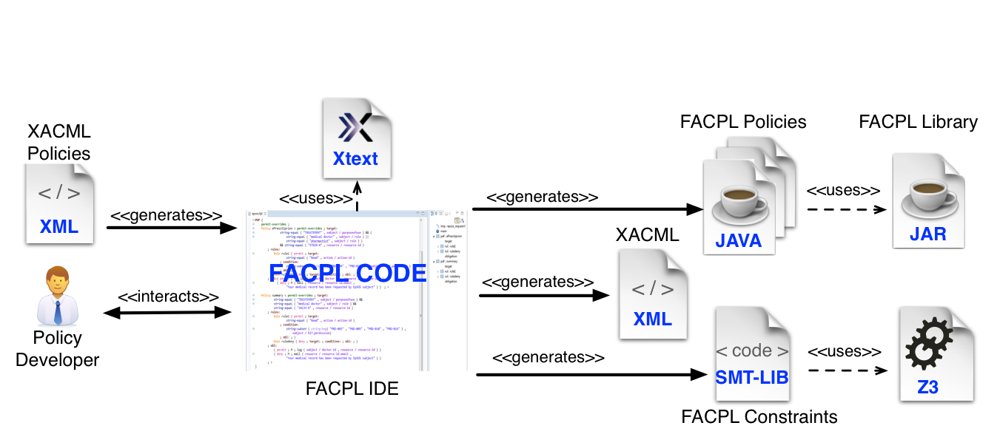
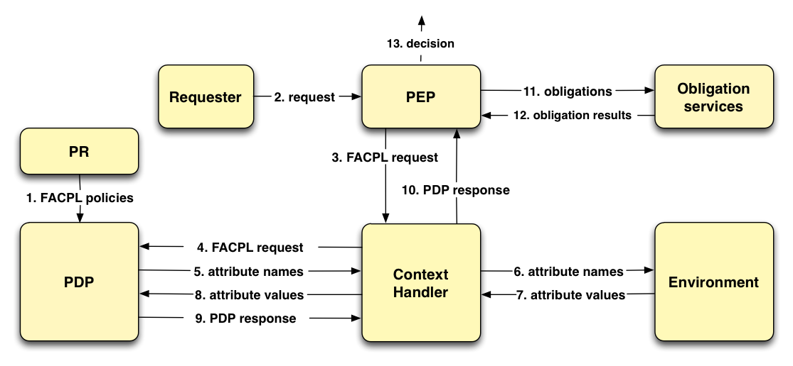

FACPL at a glance 
------------------

**FACPL: Specifying, Analysing and Enforcing Access Control Policies**

The FACPL language is a formal, easy-to-use language that permits
specifying access control policies. FACPL is the basis of a feasible and
effective approach for defining access control systems. Various
applications have been proposed, varying from e-Health to autonomic
computing domains.

FACPL is equipped with a powerful Integrated Development Environment
(IDE) and a Java library, supporting access control system developers in
the tasks of specifying, analysing and enforcing FACPL policies. Figure
1 shows the toolchain enabling the use of the language.

Developers can use the IDE, in the form of an
`Eclipse <http://www.eclipse.org/>`__ plugin, for specifying the desired
policies in FACPL syntax, by taking advantage of the supporting features
provided by the environment. The IDE automatically produces a set of
Java classes enforcing the FACPL policies and of
`SMT-LIB <http://smtlib.cs.uiowa.edu/>`__ files enabling the automatic
analysis of policies. The Java FACPL library provides the compile- and
run-time support for validating and enforcing the generated Java
policies in real systems. The use of the SMT-LIB code and of the
`Z3 <https://github.com/Z3Prover>`__ constraint solver offers effective
analysis means. Furthermore, the toolchain offers a (partial)
interoperability with the
`XACML <https://www.oasis-open.org/committees/tc_home.php?wg_abbrev=xacml>`__
standard, commonly used to deploy real-world access control systems. See
Section 9.1 of `this FACPL
paper <http://local.disia.unifi.it/wp_disia/2016/wp_disia_2016_05.pdf>`__
for further details on XACML vs. FACPL interoperability.

FACPL Evaluation Process
^^^^^^^^^^^^^^^^^^^^^^^^

Policies control system resources by means of a particular evaluation
process, which relies on two main components: the *Policy Decision
Point* (PDP) and the *Policy Enforcement Point* (PEP). The former
calculates the authorization decision for an access request, and the
latter enforces such decision in the system. Figure 2 shows the FACPL
evaluation process.

Each controlled resource is paired with one or more FACPL policies,
which define the access control rules expressing the credentials
necessary to gain access to the resource. These policies are stored
within the Policy Repository (PR) that makes them available to the PDP
(step 1), which has the task of deciding whether to grant access to
resources or not. The evaluation of a request is organized in the
following steps.

-  A request to access a resource is received by the PEP (step 2) and it
   is encoded as a FACPL request containing the credentials expressed as
   attribute elements (step 3). An attribute is a pair *(name, value)*
   representing a security-relevant information.
-  The context handler sends the request to the PDP (step 4) and can add
   environmental attributes to the request, as e.g. the request
   receiving time, which may be needed for the evaluation process.
-  The PDP computes the PDP response for the request by checking the
   attributes, that may belong either to the request or to the context
   (steps 5-8), against the controls contained in the policies. The PDP
   response contains an authorization decision and, possibly, some
   obligations.
-  The PDP response is sent to the PEP, that, by appropriate obligation
   services, must discharge all possibly present obligations (steps
   9-11).
-  On the basis of the result of obligations discharge, the PEP computes
   the final decision (steps 12-13). This decision, that could differ
   from the PDP one, is the overall outcome of the evaluation process.

Notably, obligations are additional actions connected to the access
control system and might correspond to, e.g., updating a log file,
sending a message, generating an event or executing an action.
